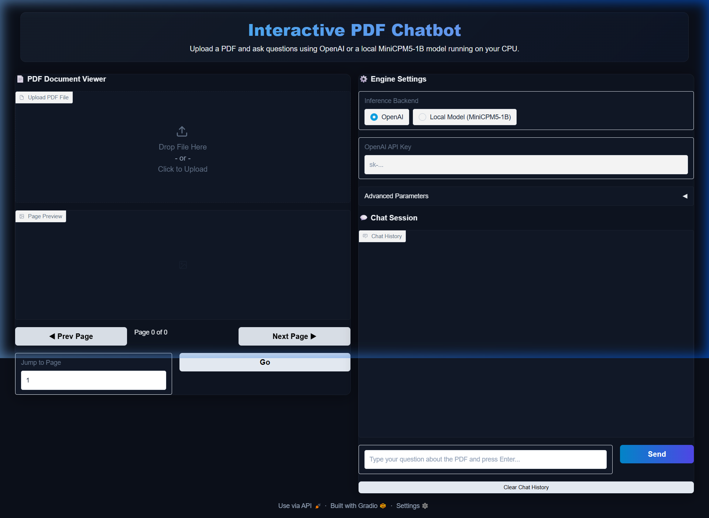
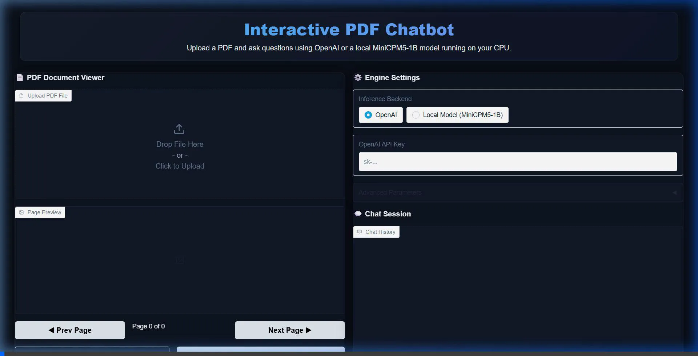

# PDF Chatbot

A production-grade, cross-platform PDF retrieval and conversation application. It allows you to upload a PDF document and converse with it using either:
1. **OpenAI API** (e.g., `gpt-4o-mini`, requires an API Key).
2. **Local MiniCPM5-1B-SFT** model (runs fully locally on your CPU/GPU, requires no API key or internet after the initial download).

The application utilizes **Chroma DB** for local vector indexing. For local embeddings, it uses **all-MiniLM-L6-v2** to ensure the entire local model pipeline runs offline and with minimum resource overhead.

---

## UI Preview



*Interaction Demonstration:*


---

## Project Structure

```
pdf_chatbot/
├── app/
│   ├── __init__.py
│   ├── config.py       # Configuration constants and model definitions
│   ├── pdf_engine.py   # PDF rendering, chunking, and Chroma DB integration
│   ├── llm_engine.py   # OpenAI and Local MiniCPM5-1B model handlers
│   └── ui.py           # Premium dark-theme Gradio 5 user interface
├── .gitignore          # Git exclusion rules
├── README.md           # This documentation
├── requirements.txt    # Python dependencies
├── run.py              # Application runner
├── start.sh            # Launch script (Linux/macOS)
└── start.bat           # Launch script (Windows)
```

---

## Setup Instructions

### Prerequisites
- **Python**: Python 3.10, 3.11, or 3.12 is recommended.
- **Operating Systems**: Supported on Linux, macOS, and Windows.

### 1. Initialize Virtual Environment
To create a clean environment that utilizes any pre-installed system site-packages (such as PyTorch and Transformers to avoid long compilations/downloads), run the following command in the project root:

**Linux / macOS:**
```bash
python3 -m venv .venv --system-site-packages --without-pip
```

**Windows (Command Prompt / PowerShell):**
```cmd
python -m venv .venv --system-site-packages --without-pip
```

### 2. Install Dependencies
Activate the virtual environment and install the required libraries:

**Linux / macOS:**
```bash
source .venv/bin/activate
python3 -m pip install -r requirements.txt
```

**Windows:**
```cmd
.venv\Scripts\activate
python -m pip install -r requirements.txt
```

---

## Running the Application

For convenience, you can launch the application directly using the provided startup scripts:

**Linux / macOS:**
```bash
./start.sh
```

**Windows:**
Double-click `start.bat` or run:
```cmd
start.bat
```

Once running, the terminal will display a local URL (e.g., `http://127.0.0.1:7860`). Open this in your browser to interact with the application.

---

## Features & Settings

- **Dual-Model Support**: Select between OpenAI Chat Models and the local MiniCPM5-1B-SFT model from the UI.
- **Local Embeddings**: Selecting the local model automatically switches text vectorization to `sentence-transformers/all-MiniLM-L6-v2`, rendering the chatbot fully self-contained.
- **Interactive PDF Viewer**: Renders and previews PDF pages. Use the navigation buttons in the UI to page through your document manually.
- **Hybrid Reasoning**: MiniCPM5-1B-SFT's built-in "Think/No-Think" reasoning mode can be toggled via the settings panel.
- **Chroma DB Persistence**: Vector databases are saved to `.chromadb/` locally, letting you query previously indexed PDFs instantly.
- **Included Demo PDFs**: We have included two landmark AI research papers in the `demo_pdfs/` folder for quick testing:
  1. `attention_is_all_you_need.pdf`: The foundational Transformer architecture paper.
  2. `gpt3_paper.pdf`: The language models are few-shot learners (GPT-3) paper.
